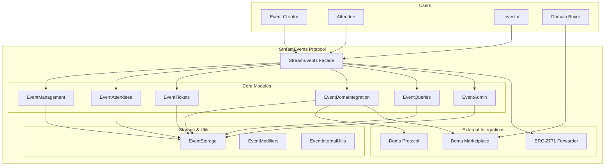
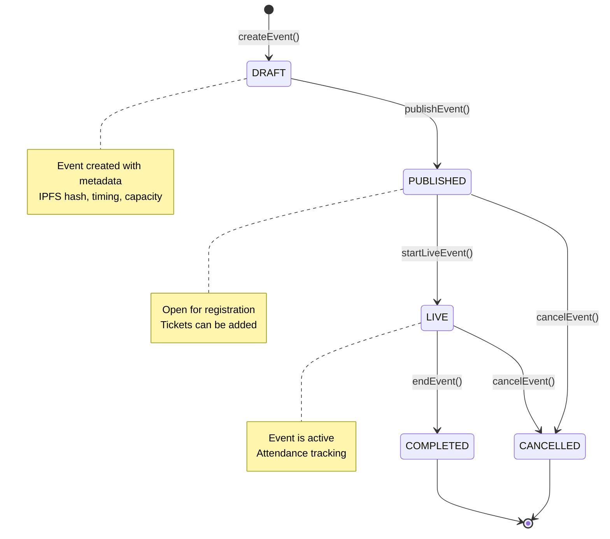
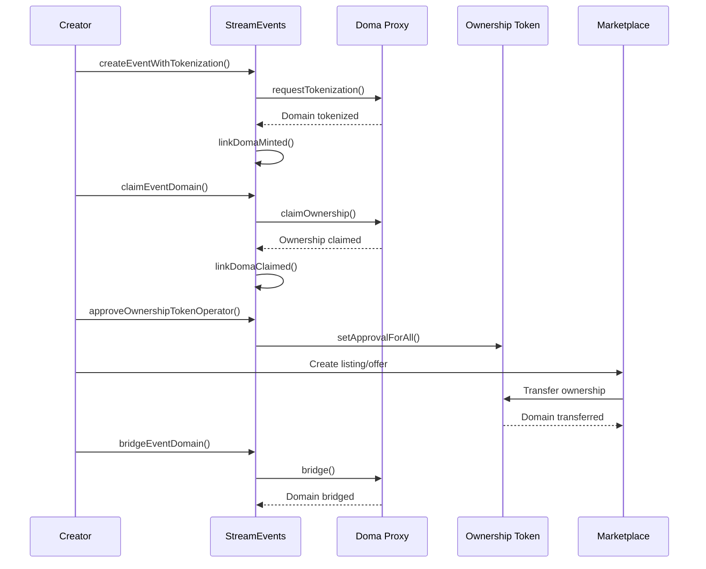
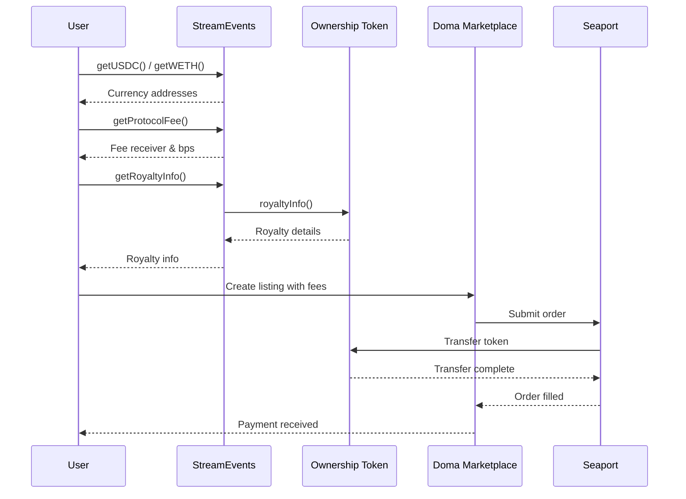
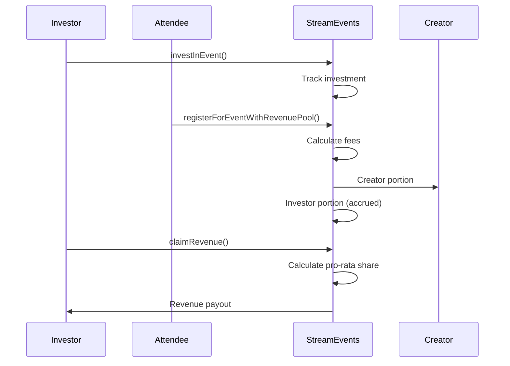
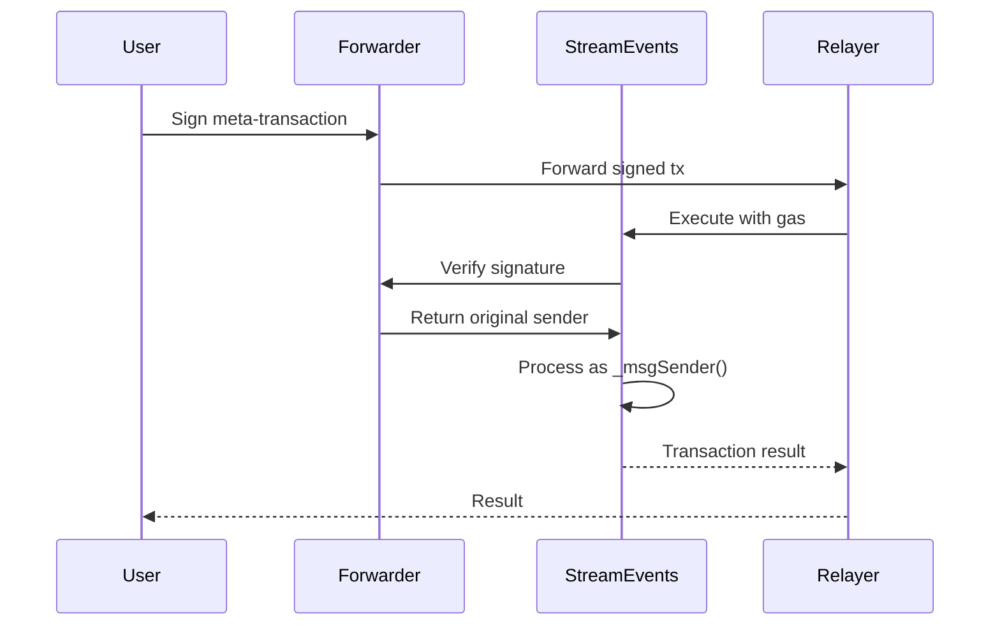

# StreamEvents Protocol

A comprehensive onchain events and ticketing protocol with Doma domain ownership integration, gasless transactions via ERC-2771, and optional investor revenue sharing. The protocol enables event creators to tokenize their event domains, trade them on Doma marketplace, and share revenue with investors while supporting gasless meta-transactions through Doma's trusted forwarder.

## Key Features

- **Event Management**: Complete lifecycle from creation to completion with IPFS metadata storage
- **Gasless Transactions**: ERC-2771 meta-transaction support via Doma's trusted forwarder
- **Domain Tokenization**: Integrate with Doma protocol to tokenize event domains as NFTs
- **Marketplace Trading**: Built-in support for trading domains on Doma marketplace with Seaport protocol
- **Revenue Sharing**: Optional investor pools with pro-rata revenue distribution
- **Ticketing System**: Flexible ticket creation with pricing, supply limits, and perks
- **Attendance Tracking**: Confirmation codes and attendance verification
- **Cross-chain Bridging**: Bridge tokenized domains across supported blockchains

## Table of Contents
- [Architecture Overview](#architecture-overview)
- [System Architecture Diagram](#system-architecture-diagram)
- [Event Lifecycle Flow](#event-lifecycle-flow)
- [Doma Integration Flow](#doma-integration-flow)
- [Marketplace Trading Flow](#marketplace-trading-flow)
- [Revenue Sharing Flow](#revenue-sharing-flow)
- [Gasless Transactions](#gasless-transactions)
- [Core Components](#core-components)
- [Deployment and Configuration](#deployment-and-configuration)
- [Usage Examples](#usage-examples)
- [Security Considerations](#security-considerations)
- [Testing](#testing)

## Architecture Overview

StreamEvents is built as a modular system with a facade pattern, where the main `StreamEvents` contract composes multiple feature modules. The architecture supports gasless transactions through ERC-2771, integrates with Doma's domain tokenization protocol, and provides marketplace trading capabilities.

### Core Design Principles

1. **Modular Architecture**: Each feature is isolated in its own module for maintainability
2. **Gasless Support**: ERC-2771 meta-transactions via Doma's trusted forwarder
3. **Domain Integration**: Seamless tokenization and trading of event domains
4. **Revenue Sharing**: Flexible investor participation with pro-rata distribution
5. **Security First**: Reentrancy protection, access controls, and input validation

## System Architecture Diagram



## Event Lifecycle Flow



## Doma Integration Flow



## Marketplace Trading Flow



## Revenue Sharing Flow



## Gasless Transactions



## Core Components

### StreamEvents Facade
The main contract that composes all feature modules and provides the public API.

**Key Features:**
- ERC-2771 meta-transaction support
- Doma marketplace integration
- Owner-configurable addresses
- Comprehensive event management

### Event Management Module
Handles the complete event lifecycle from creation to completion.

**Functions:**
- `createEvent()` - Create new events with validation
- `updateEvent()` - Modify event details (creator only)
- `publishEvent()` - Make event public for registration
- `startLiveEvent()` - Begin live event
- `endEvent()` / `cancelEvent()` - Complete or cancel events

### Doma Integration Module
Manages domain tokenization, claiming, and marketplace interactions.

**Functions:**
- `createEventWithTokenization()` - Create event and tokenize domain
- `claimEventDomain()` - Claim ownership of tokenized domain
- `bridgeEventDomain()` - Bridge domain to other chains
- `approveOwnershipTokenOperator()` - Approve marketplace operators
- `getRoyaltyInfo()` - Query domain royalties for marketplace

### Revenue Sharing Module
Enables investor participation and pro-rata revenue distribution.

**Functions:**
- `investInEvent()` - Deposit funds for revenue sharing
- `registerForEventWithRevenuePool()` - Registration with investor split
- `claimRevenue()` - Claim accrued revenue (investors)

### Ticketing Module
Comprehensive ticket management with pricing and supply controls.

**Functions:**
- `addTicket()` - Create ticket types with pricing
- `updateTicket()` - Modify ticket details
- `buyTicket()` - Purchase tickets with auto-registration
- `removeTicket()` - Deactivate tickets

## Deployment and Configuration

### Prerequisites
- Foundry installed
- Private key with deployment funds
- Doma testnet RPC URL

### Build and Deploy

```bash
# Build contracts
forge build

# Deploy to Doma testnet
forge script script/DeployDoma.s.sol --rpc-url <DOMA_RPC> --broadcast --private-key <PRIVATE_KEY>
```

### Configuration

The deploy script automatically configures:
- Doma testnet addresses (Proxy, Ownership Token, Forwarder)
- Marketplace currencies (USDC, wETH)
- Protocol fees (0.5% to Doma protocol)
- Platform settings (2.5% platform fee)

### Manual Configuration

```bash
# Set Doma configuration
cast send <CONTRACT> "setDomaConfig(address,address,address,uint256,string)" \
  <DOMA_PROXY> <OWNERSHIP_TOKEN> <FORWARDER> 0 "doma" \
  --rpc-url <RPC> --private-key <PRIVATE_KEY>

# Set marketplace currencies
cast send <CONTRACT> "setMarketplaceCurrencies(address,address)" \
  <USDC_ADDRESS> <WETH_ADDRESS> \
  --rpc-url <RPC> --private-key <PRIVATE_KEY>

# Set protocol fees
cast send <CONTRACT> "setMarketplaceProtocolFee(address,uint256)" \
  <FEE_RECEIVER> 50 \
  --rpc-url <RPC> --private-key <PRIVATE_KEY>
```

## Usage Examples

### 1. Create and Tokenize Event

```bash
# Create event with domain tokenization
cast send <CONTRACT> "createEventWithTokenization(string,uint256,uint256,uint256,uint256,tuple,bytes)" \
  "QmHash..." $(date -d "+1 day" +%s) $(date -d "+2 days" +%s) 100 1000000000000000 \
  '["example.com","eth"]' 0 0 0x0000000000000000000000000000000000000000 0 \
  0x0000000000000000000000000000000000000000000000000000000000000000000000000000000000000000000000000000000000000000000000000000000000 \
  --value 1000000000000000 --rpc-url <RPC> --private-key <CREATOR_KEY>
```

### 2. Register for Event

```bash
# Standard registration
cast send <CONTRACT> "registerForEvent(uint256)" <EVENT_ID> \
  --value 1000000000000000 --rpc-url <RPC> --private-key <USER_KEY>

# Registration with revenue sharing
cast send <CONTRACT> "registerForEventWithRevenuePool(uint256)" <EVENT_ID> \
  --value 1000000000000000 --rpc-url <RPC> --private-key <USER_KEY>
```

### 3. Manage Tickets

```bash
# Add ticket
cast send <CONTRACT> "addTicket(uint256,string,string,uint256,string,uint256,string[])" \
  <EVENT_ID> "VIP" "Premium" 50000000000000000 "ETH" 50 '["Backstage access","Free drinks"]' \
  --rpc-url <RPC> --private-key <CREATOR_KEY>

# Buy ticket
cast send <CONTRACT> "buyTicket(uint256,uint256)" <EVENT_ID> <TICKET_ID> \
  --value 50000000000000000 --rpc-url <RPC> --private-key <USER_KEY>
```

### 4. Domain Trading

```bash
# Approve marketplace operator
cast send <CONTRACT> "approveOwnershipTokenOperator(address,bool)" \
  <SEAPORT_CONDUIT> true --rpc-url <RPC> --private-key <CREATOR_KEY>

# Query marketplace info
cast call <CONTRACT> "getUSDC()" --rpc-url <RPC>
cast call <CONTRACT> "getWETH()" --rpc-url <RPC>
cast call <CONTRACT> "getProtocolFee()" --rpc-url <RPC>
cast call <CONTRACT> "getRoyaltyInfo(uint256,uint256)" <TOKEN_ID> 1000000000000000000 --rpc-url <RPC>
```

### 5. Revenue Sharing

```bash
# Invest in event
cast send <CONTRACT> "investInEvent(uint256)" <EVENT_ID> \
  --value 1000000000000000000 --rpc-url <RPC> --private-key <INVESTOR_KEY>

# Claim revenue
cast send <CONTRACT> "claimRevenue(uint256)" <EVENT_ID> \
  --rpc-url <RPC> --private-key <INVESTOR_KEY>
```

## Security Considerations

### Access Control
- **Owner Functions**: Protocol configuration and emergency controls
- **Creator Functions**: Event management and domain operations
- **Public Functions**: Registration, ticketing, and revenue claims

### Reentrancy Protection
- All payable functions use `nonReentrant` modifier
- State changes before external calls
- Safe transfer patterns

### Input Validation
- Time bounds validation for events
- Fee limits and capacity checks
- Domain tokenization verification

### Gasless Transaction Security
- Trusted forwarder verification
- Signature validation through ERC-2771
- Original sender preservation

## Testing

### Run Tests
```bash
# Run all tests
forge test -vvvv

# Run specific test
forge test --match-test testCreateEvent -vvvv

# Gas report
forge test --gas-report
```

### Test Coverage
- Event lifecycle management
- Registration and attendance flows
- Ticket creation and purchasing
- Doma integration (mocking)
- Revenue sharing calculations
- Access control enforcement

## Repository Structure

```
contract/
├── src/
│   ├── event.sol                 # Main StreamEvents facade
│   ├── events/                   # Feature modules
│   │   ├── Storage.sol          # Centralized state
│   │   ├── Management.sol       # Event lifecycle
│   │   ├── Attendees.sol        # Registration & attendance
│   │   ├── Tickets.sol          # Ticket management
│   │   ├── DomaIntegration.sol  # Domain tokenization
│   │   ├── Queries.sol          # Read-only APIs
│   │   ├── Admin.sol            # Protocol administration
│   │   └── Types.sol            # Data structures
│   └── doma/                    # Doma integration
│       └── interfaces/          # External contract interfaces
├── script/
│   ├── DeployDoma.s.sol         # Doma testnet deployment
│   └── DeployAndTest.s.sol      # General deployment
├── test/
│   └── event.t.sol              # Unit tests
└── foundry.toml                 # Build configuration
```

## License

MIT

